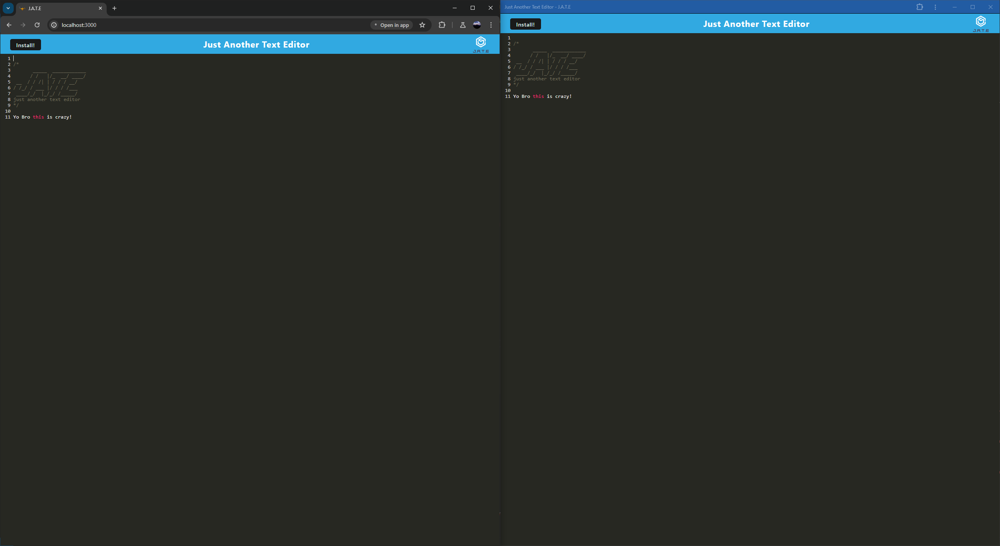

  # Text Editor

  

  ## Description

  - Motivation: A quick and reliable text editor that can still function without a connection to the internet.
  - Problem solved: Sometime you can be working in a text editor when you lose connection to the internet. With this text editor, you are able to continue working on code enven once you have gone offline.
  - What was learned: I learned a ton about PWAs and service workers when it comes to managing an apllication on a local machine.

  ## Table of Contents

  - [Installation](#installation)
  - [Usage](#usage)
  - [Credits](#credits)
  - [License](#license)
  - [Badges](#badges)
  - [Features](#features)
  - [Contribute](#contribute)
  - [Tests](#tests)
  - [Contact](#contact)

  ## Installation

  - Navigate to the web page click on the install button. Then, click install on the intall button that pops up after clicking it. Then the application will be installed locally.

  ## Usage

  - After installing the application it is as easy as opening it up just as any  other application and using it to edit text.
  - Deployed Project link -> [Just Another Text Editor](https://just-another-text-editor-liqb.onrender.com)
  
      

  ## Credits

  - I want to give am absolutely massive thanks to [Josh Slem](https://github.com/SlemJosh) as he was very instrumental in the functioning of this application.

  ## License

  - This project is being covered under the MIT license

  - A list of available licenses and their meanings can be found here: [https://choosealicense.com/](https://choosealicense.com/)

  ## Badges

    
  
  ## Features

  - This has the feature to be downloaded locally as a PWA.

  ## Contribute

  - This project is not open for contribution.

  ## Tests

  - There are no tests included with this project.

  ## Contact

  - Ways you can contact me for any questions: https://github.com/ProgramerNinja
